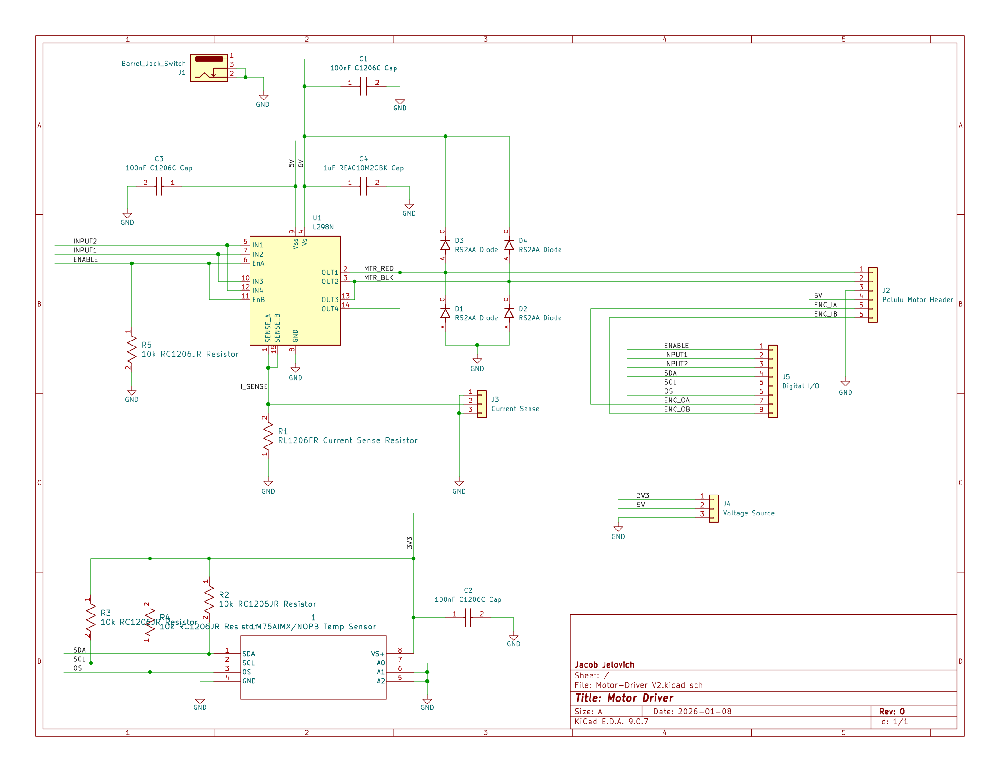

# ECE5780-Motor-Driver-PID-Controller

## Project Overview
This project was the culmination of multiple homework assignments and lab assignments for ECE 5780-Embedded Systems at the University of Utah.  

The assignments guided me through learning to use **KiCad** for PCB design using schematic and layout design, as well as writing firmware for the **STM32F072-Discovery** Development board in **C**.  
I was tasked with creating a PID controller that could control a Polulu DC motor with an encoder and make it shift from **80 rpm to 50 rpm, then back to 80 rpm, and finally off**.  

The PCB design featured an L298N H-Bridge to control the speed and direction of the motor and an LM75A temperature sensor.

### Schematic

